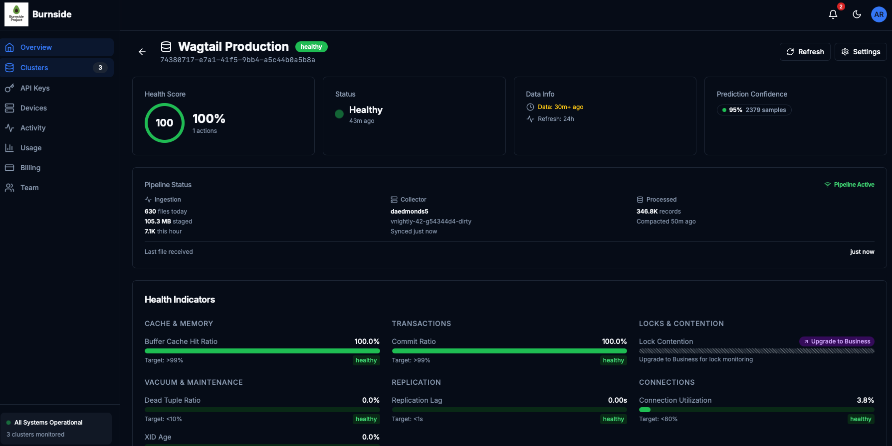
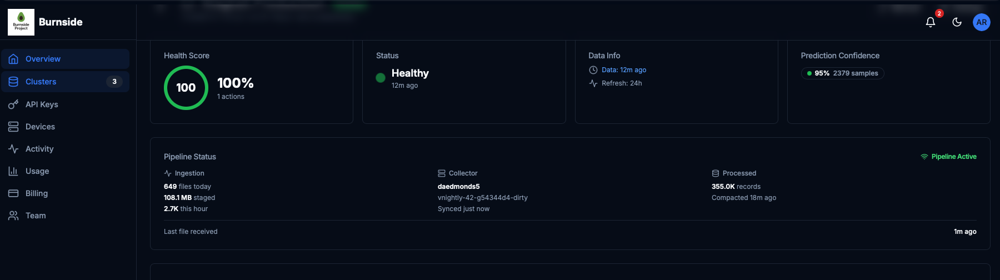

<h1 align="center">PG Collector</h1>

<p align="center">
  <strong>From Signals to Prediction</strong><br>
  <em>Lightweight Agent for AI-Powered PostgreSQL Intelligence</em>
</p>

<p align="center">
  <b>Distribution Repository</b> — This repository contains release binaries, installation scripts, and documentation.<br>
  Source code is closed-source. For licensing inquiries: <a href="mailto:licensing@burnsideproject.ai">licensing@burnsideproject.ai</a>
</p>

<p align="center">
  
  
  
</p>

<p align="center">
  <a href="#quick-install">Install</a> |
  <a href="#features">Features</a> |
  <a href="#ai-powered-prediction">AI Prediction</a> |
  <a href="#subscription-tiers">Tiers</a> |
  <a href="docs/quick-start.md">Quick Start</a> |
  <a href="docs/configuration.md">Configuration</a>
</p>

---

## Overview

**Stop reacting to database issues—start predicting them.**

PG Collector is a lightweight edge compute agent that extracts PostgreSQL telemetry and delivers it to configurable destinations—locally for evaluation, or streamed to cloud platform where AI LLM analyzes patterns and predicts issues before they impact your users.

**Single binary. Zero dependencies. 5-minute setup.**

```
┌──────────────┐      ┌──────────────┐      ┌──────────────┐      ┌──────────────┐
│ PostgreSQL   │ ───▶ │ pg-collector │ ───▶ │   Multi or   | ───▶ | Predictions  |
|  Database    |      | Edge (Agent) |      | Single Tenant|      |   & Alerts   |
|              │      │              │      |  AWS or GCP  |      |              |
│              │      │              │      │    Cloud     │      │              |
└──────────────┘      └──────────────┘      └──────────────┘      └──────────────┘
```

---

## Two Editions

PG Collector is available in two editions:

### Demo Edition (Free)

> **Try it locally—no cloud account required.**

- Single binary, zero external dependencies
- Runs locally; all output stays on your machine
- Cut and Paste the outputs from pg-collector to your local AI Chat Windows
- Core PostgreSQL samplers: activity, database, and statements ([PostgreSQL Wiki](https://wiki.postgresql.org/wiki/Main_Page))
- Example Prompt is provided for instant analysis
- Perfect for evaluation, learning, and local development

### Commercial Edition (Subscription)

> **Everything in Demo, plus the full power of AWS or GCP Cloud**

- **Up to 12 PostgreSQL metric samplers** — activity, performance, replication, WAL, locks, vacuum, bloat, and more
- **AI-powered health reports** with prescriptions and root cause analysis
- **Predictive analytics** and anomaly detection
- **Real-time streaming** to Burnside Cloud
- **Interactive health dashboard** with configuration audit
- **PII detection**, audit logging, and query masking
- **Multi-database monitoring** — scale from one database to unlimited
- **Offline resilience** — continues collecting during network outages
- **Enterprise authentication** — mTLS, AWS IAM, GCP IAM Only
- **Flexible deployment** — systemd, Docker, Kubernetes
- **Dedicated support** — email, priority, and SLA tiers available


**Ready to upgrade?** [Book a demo](https://calendar.google.com/calendar/u/0/appointments/schedules/AcZssZ0jW4tXS9oprMT773HT843ndiFdPXAK7pro0FhX3mCpVWyYE0Y0adsAe-cPVrVSqrQ0Bm2n4cPS) or visit [burnsideproject.ai](https://burnsideproject.ai).

---

## Local LLM Demo Testing

> **Want to try AI-powered analysis without the cloud?**

**[Download Standalone Local Demo](https://burnsideproject.ai/download/pg-collector-agent-demo)**  
This standalone local testing tool that lets you analyze pg-collector telemetry using your own LLM (ChatGPT, Claude, etc.). No API keys or cloud infrastructure required.

```
┌─────────────────────────────────────────────────────────────────────────┐
│                     Your Environment (Edge Only)                        │
│                                                                         │
│  PostgreSQL ──→ pg-collector ──→ ./telemetry/*.jsonl                   │
│                 (single binary)         │                               │
│                                         ▼                               │
│                              ./prepare-snapshot.sh                      │
│                                         │                               │
│                                         ▼                               │
│                              telemetry-snapshot.json ──→ Your LLM      │
└─────────────────────────────────────────────────────────────────────────┘
```

### Quick Start (Demo)
Follow the README.md enclosed in the download


### Test with your own LLM Chat Application (ChatGPT , Claude - We provide you demo Prompt but feel free to use your own prompt)


### What Prompts are Included?

| Prompt | Use Case |
|--------|----------|
| `01-health-check.md` | General database health assessment |
| `02-slow-queries.md` | Query performance optimization |
| `03-incident-investigation.md` | Diagnose active problems |
| `04-capacity-planning.md` | Resource utilization and scaling |
| `05-quick-diagnosis.md` | Fast 30-second triage |

### Demo vs. Commercial

| Capability | Demo (Free) | Commercial (Subscription) |
|------------|:-----------:|:-------------------------:|
| Single binary, runs locally | ✅ | ✅ |
| Core samplers (activity, database, statements) | ✅ | ✅ |
| Export snapshots to your LLM | ✅ | ✅ |
| Real-time cloud streaming | ❌ | ✅ |
| Continuous monitoring | ❌ | ✅ |
| AI health reports with prescriptions | ❌ | ✅ |
| Interactive health dashboard | ❌ | ✅ |
| Configuration audit | ❌ | ✅ |
| Predictive analytics & anomaly detection | ❌ | ✅ |
| Extended samplers (WAL, locks, replication, bloat, etc.) | ❌ | ✅ |
| Automated alerts (Slack/PagerDuty) | ❌ | ✅ |
| Historical analysis | ❌ | ✅ |
| Multi-database monitoring | ❌ | ✅ |

---

## Manual Download

Download the latest release from the [Releases page](https://github.com/burnside-project/pg-collector/releases).

| Platform | Architecture | File |
|----------|--------------|------|
| **Linux** | x86_64 (amd64) | `pg-collector-linux-amd64.tar.gz` |
| **Linux** | ARM64 | `pg-collector-linux-arm64.tar.gz` |
| **macOS** | Intel (x86_64) | `pg-collector-darwin-amd64.tar.gz` |
| **macOS** | Apple Silicon | `pg-collector-darwin-arm64.tar.gz` |
| **Windows** | x86_64 | `pg-collector-windows-amd64.zip` |

### Verify Download

Each release includes a `checksums.txt` file. After downloading:

```bash
sha256sum -c checksums.txt --ignore-missing
```

---

## Choose Your Plan

**Start small, scale as you grow.** All commercial plans include predictive analytics and alerting.

| | **Starter** | **Pro** | **Business** | **Enterprise** |
|---|:---:|:---:|:---:|:---:|
| **Databases** | 1 | Multiple | Many | Unlimited |
| **Metric Samplers** | Core | Extended | Full | Full + Custom |
| **Alert Frequency** | Daily digest | Near real-time | Real-time | Real-time |
| **Data Retention** | Standard | Extended | Long-term | Custom |
| **Query Masking** | Basic | Full | Full | Custom rules |
| **AI Insights** | Summary reports | Detailed analysis | Predictive | Interactive + Custom |
| **Support** | Community | Email | Priority | SLA-backed |

**Ready to get started?** [Book a demo](mailto:sales@burnsideproject.ai) or [try the free evaluation](#local-llm-demo-testing).

---

## AI-Powered Prediction

**The intelligence behind the insights.** Our AI transforms raw database metrics into predictions you can act on.

```
┌─────────────┐      ┌─────────────┐      ┌─────────────┐
│ PG Collector│ ───▶ │  AWS or GCP │ ───▶ │   Alerts    │
│   Metrics   │      |  AI Agents  |      |             |
|             |      |  Predictions│      │ Slack/Email │
└─────────────┘      └─────────────┘      └─────────────┘
```

### What the AI Predicts

| Prediction Type | What It Detects |
|-----------------|-----------------|
| **Connection Exhaustion** | Pool approaching limits based on growth patterns |
| **Replication Lag Spike** | Replica falling behind due to write surge |
| **Lock Contention** | Blocking chains forming from concurrent transactions |
| **Cache Pressure** | Buffer cache hit ratio degrading |
| **Vacuum Emergency** | Tables approaching transaction wraparound |
| **Query Degradation** | Execution plans changing, slow query emergence |

### How It Works

The AI engine continuously analyzes your PostgreSQL metrics, detects patterns, and delivers:

- **Severity-rated alerts** — Know what's critical vs. informational
- **Confidence scoring** — Understand how certain the prediction is
- **Evidence-based reasoning** — See the data points driving the alert
- **Recommended actions** — Get specific, actionable fix suggestions

### Cloud Platform Features

When connected to Burnside Project Cloud Engine, commercial subscribers get access to:

**Control Panel**



| Feature | Description |
|---------|-------------|
| **Health Dashboard** | Real-time overview of all monitored databases with status indicators |
| **AI Health Reports** | Automated database health assessments with severity ratings |
| **Prescriptions** | Specific, actionable fix recommendations generated by AI |
| **Configuration Audit** | Detects suboptimal PostgreSQL settings and suggests improvements |
| **Anomaly Detection** | Machine learning identifies unusual patterns in your metrics |
| **Rule Engine** | Customizable alert rules with flexible thresholds and conditions |
| **Query Analytics** | Statement-level performance tracking with trend analysis |
| **Replication Monitoring** | Lag tracking across primary and replica topologies |
| **Vacuum Intelligence** | Proactive alerts for autovacuum health and wraparound risk |
| **Capacity Planning** | Growth trend projections for connections, storage, and throughput |
| **Historical Analysis** | Query and compare metrics across configurable retention windows |
| **Multi-Database Views** | Unified monitoring across all your PostgreSQL instances |

---

## Features
**AI Agent for Analysis + Recommended Action**

**Connects to Control Plane like an Edge Compute**


**mTLS authentication to your control plane**


**AI Agent for Analysis + Recommended Action**


**AI-Generated Prescriptive Runbooks for Faster Resolution**


**Detail Metrics**


**Current Config Audit + Recommendation with Postgres Recommended Alignments**


**Cloud Mico Batching Pipeline**



**Building Adaptive State**


**Feature Store that AI can label Normal vs Outside Normal**


**Features building defining 950, p95, p99**


### What We Capture

| Category | What You Learn | How Fast |
|----------|----------------|----------|
| **Activity** | Which queries are running, waiting, or blocked | Real-time |
| **Performance** | Slow queries, cache misses, I/O bottlenecks | Continuous |
| **Replication** | Lag alerts before replicas fall behind | Real-time |
| **Storage** | Table bloat and growth trends | Periodic |
| **Background** | Vacuum health and checkpoint pressure | Periodic |

### Built for Production

| Guarantee | What It Means |
|-----------|---------------|
| **Memory Safe** | Configurable ceiling with automatic management—never runaway |
| **Network Resilient** | Local buffering survives outages—zero data loss |
| **Minimal Footprint** | Max 2 PostgreSQL connections, timeout-protected queries |
| **Secure by Default** | mTLS or IAM auth—no passwords in config files |

### Connect Your Way

| Method | Best For | Guide |
|--------|----------|-------|
| **mTLS Certificates** | Self-managed PostgreSQL (most secure) | [Security Guide](docs/security.md) |
| **AWS IAM** | RDS, Aurora (passwordless) | [AWS Setup](docs/aws-setup.md) |
| **GCP IAM** | Cloud SQL (passwordless) | [GCP Setup](docs/gcp-setup.md) |

---

## Quick Configuration

You configure your API key and database connection. Metrics delivery is handled automatically.

```yaml
# Your API key (provided during onboarding)
api_key: "${API_KEY}"

# Your PostgreSQL connection
postgres:
  conn_string: "postgres://pgcollector@your-db:5432/postgres?sslmode=verify-full"
  auth_method: cert
  tls:
    mode: verify-full
    ca_file: /etc/pg-collector/certs/ca.crt
    cert_file: /etc/pg-collector/certs/client.crt
    key_file: /etc/pg-collector/certs/client.key
```

See [Configuration Guide](docs/configuration.md) for all options.

---

## Running as a Service


### Systemd (Linux)

```bash
sudo systemctl enable pg-collector
sudo systemctl start pg-collector
sudo systemctl status pg-collector
```

### Docker

```bash
docker run -d \
  --name pg-collector \
  -v /etc/pg-collector:/etc/pg-collector:ro \
  ghcr.io/burnside-project/pg-collector:latest
```

---

## Health & Monitoring

```bash
# Basic health check
curl http://localhost:8080/health

# Detailed status
curl http://localhost:8080/status

# Prometheus metrics
curl http://localhost:8080/metrics
```

---

## How It Works

**From install to insights in under 5 minutes.**

1. **Install** — Download and run the single binary
2. **Connect** — Point it at your PostgreSQL database
3. **Stream** — Metrics flow securely to Burnside Cloud
4. **Predict** — AI analyzes patterns and alerts you before problems hit

---

## Documentation

| Guide | Description |
|-------|-------------|
| [Quick Start](docs/quick-start.md) | Get running in 5 minutes |
| [Installation](docs/installation.md) | Detailed installation guide |
| [Configuration](docs/configuration.md) | All configuration options |
| [Security](docs/security.md) | mTLS setup, certificate management |
| [AWS Setup](docs/aws-setup.md) | RDS, Aurora deployment |
| [GCP Setup](docs/gcp-setup.md) | Cloud SQL deployment |
| [Monitoring](docs/monitoring.md) | Health checks, Prometheus metrics |
| [CLI Reference](docs/cli-reference.md) | Command-line options |
| [Troubleshooting](docs/troubleshooting.md) | Common issues and solutions |
| [FAQ](docs/faq.md) | Frequently asked questions |

For detailed commercial documentation, see the [`/docs`](docs/) directory.

---

## Support

- **Documentation:** [docs/](docs/)
  - **Issues:** [GitHub Issues](https://github.com/burnside-project/pg-collector/issues)
  - **Sales:** [sales@burnsideproject.ai](mailto:sales@burnsideproject.ai)
  - **Support:** [support@burnsideproject.ai](mailto:support@burnsideproject.ai)

---

## License

Copyright © 2024–2026 Burnside Project LLC. All rights reserved.

This software is licensed under the **Burnside Project Community Freeware License v1.1**. This is **not open source software**.

**You may** use this software free of charge for personal, educational, evaluation, and private business purposes.

**You may not** redistribute, sell, sublicense, or offer this software as a hosted service, SaaS, or component of a commercial product without a separate commercial license.

For commercial licensing inquiries, contact [licensing@burnsideproject.ai](mailto:licensing@burnsideproject.ai).

See [LICENSE](LICENSE) for the complete license text.

---

<p align="center">
  <strong>From Signals to Prediction. Stop reacting. Start predicting.</strong><br>
  <sub>AI-powered database observability by <a href="https://burnsideproject.ai">Burnside Project</a></sub>
</p>
